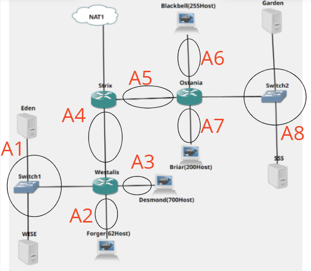
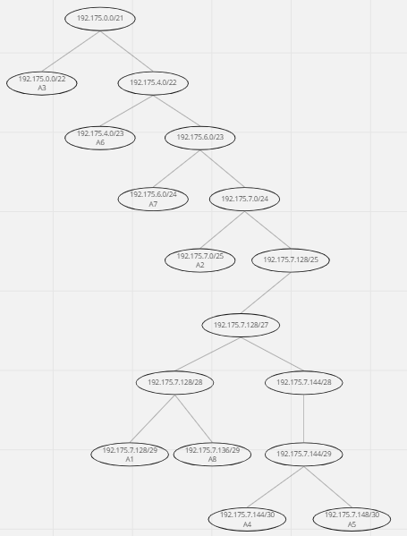
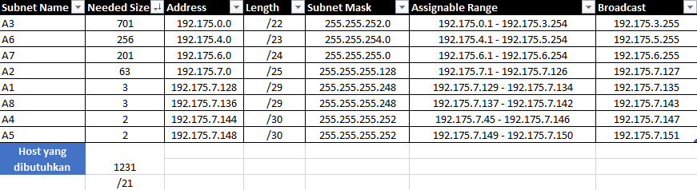

# Jarkom-Modul-5-T7-2021      
### Laporan Resmi Pengerjaan Sesi Lab Jaringan Komputer     
        
#### Nama Anggota Kelompok :      
1. Helsa Nesta Dhaifullah (5025201005)     
2. Achmad Nashruddin Riskynanda	 (5025201021)      
3. Haniif Ahmad Jauhari (5025201224)  


## Soal Modul 5
Setelah kalian mempelajari semua modul yang telah diberikan, Loid ingin meminta bantuan untuk terakhir kalinya kepada kalian. Dan kalian dengan senang hati mau membantu Loid.
1. Tugas pertama kalian yaitu membuat topologi jaringan sesuai dengan rancangan yang diberikan Loid
2. Keterangan :	Eden adalah DNS Server
                WISE adalah DHCP Server
		Garden dan SSS adalah Web Server
		Jumlah Host pada Forger adalah 62 host
		Jumlah Host pada Desmond adalah 700 host
		Jumlah Host pada Blackbell adalah 255 host
		Jumlah Host pada Briar adalah 200 host        
3. Untuk menjaga perdamaian dunia, Loid ingin meminta kalian untuk membuat topologi tersebut menggunakan teknik CIDR atau VLSM setelah melakukan subnetting. 
4. Anya, putri pertama Loid, juga berpesan kepada anda agar melakukan Routing agar setiap perangkat pada jaringan tersebut dapat terhubung.
5. Tugas berikutnya adalah memberikan ip pada subnet Forger, Desmond, Blackbell, dan Briar secara dinamis menggunakan bantuan DHCP server. Kemudian kalian ingat bahwa kalian harus setting DHCP Relay pada router yang menghubungkannya.

## Jawaban Modul 
### Perhitungan VLSM
Berikut adalah topologi dan pembagian subnet



Berikut adalah Tree yang sudah kita buat



Berikut adalah Perhitungannya



### Konfigurasi Network setiap node
[ Strix ]
```
auto eth0
iface eth0 inet dhcp

auto eth1
iface eth1 inet static
	address 192.175.7.145
	netmask 255.255.255.252

auto eth2
iface eth2 inet static
	address 192.175.7.149
	netmask 255.255.255.252
```

[ Westalis ]
```
auto eth0
iface eth0 inet static
	address 192.175.7.146
	netmask 255.255.255.252
	gateway 192.175.7.145

auto eth1
iface eth1 inet static
	address 192.175.7.129
	netmask 255.255.255.248

auto eth2
iface eth2 inet static
	address 192.175.7.1
	netmask 255.255.255.128

auto eth3
iface eth3 inet static
	address 192.175.0.1
	netmask 255.255.252.0
```

[  Ostania ]
```
auto eth0
iface eth0 inet static
	address 192.175.7.150
	netmask 255.255.255.252
	gateway 192.175.7.149

auto eth1
iface eth1 inet static
	address 192.175.4.1
	netmask 255.255.254.0

auto eth2
iface eth2 inet static
	address 192.175.6.1
	netmask 255.255.255.0

auto eth3
iface eth3 inet static
	address 192.175.7.137
	netmask 255.255.255.248
```

[ Forger ], [ Desmond ], [ Blackbell ], [ Briar ]
```
auto eth0
iface eth0 inet dhcp

```
[ Eden ]
```
auto eth0
iface eth0 inet static
	address 192.175.7.130
	netmask 255.255.255.248
	gateway 192.175.7.129


```
[ Wise ]
```
auto eth0
iface eth0 inet static
	address 192.175.7.131
	netmask 255.255.255.248
	gateway 192.175.7.129
```

[ SSS ]
```
auto eth0
iface eth0 inet static
	address 192.175.7.139
	netmask 255.255.255.248
	gateway 192.175.7.137
```

[ Garden ]
```
auto eth0
iface eth0 inet static
	address 192.175.7.138
	netmask 255.255.255.248
	gateway 192.175.7.137

```

### Routing dan Konfigurasi DNS, Web server, DHCP Server, dan DHCP relay
[ Strix ]
```
#down
route add -net 192.175.7.128 netmask 255.255.255.248 gw 192.175.7.146 #A1
route add -net 192.175.7.0 netmask 255.255.255.128 gw 192.175.7.146 #A2
route add -net 192.175.0.0 netmask 255.255.252.0 gw 192.175.7.146 #A3
#right
route add -net 192.175.4.0 netmask 255.255.254.0 gw 192.175.7.150 #A6
route add -net 192.175.6.0 netmask 255.255.255.0 gw 192.175.7.150 #A7
route add -net 192.175.7.136 netmask 255.255.255.248 gw 192.175.7.150 #A8
```
[ Westalis ]
```
route add -net 0.0.0.0 netmask 0.0.0.0 gw 192.175.7.145
```

[ Ostania ]
```
route add -net 0.0.0.0 netmask 0.0.0.0 gw 192.175.7.149
```   
[ Eden adalah DNS Server ] </br>
Install bind9

```
apt-get update
apt-get install bind9 -y
```
Lalu pada File  > /etc/bind/named.conf.options
```
options {
        directory "/var/cache/bind";
        forwarders {
                192.168.122.1;
        };
        allow-query { any; };
        auth-nxdomain no;    # conform to RFC1035
        listen-on-v6 { any; };
};
```
Kemudian lakukan Restart Dengan `service bind9 restart`     

[ Wise adalah DHCP Server ]  </br>
Install dhcp server
```
apt update
apt install isc-dhcp-server -y
```
Pada file /etc/default/isc-dhcp-server
```
INTERFACES="eth0"
```
Pada File > /etc/dhcp/dhcpd.conf
```
ddns-update-style none;
option domain-name "example.org";
option domain-name-servers ns1.example.org, ns2.example.org;
default-lease-time 600;
max-lease-time 7200;
log-facility local7;
subnet 192.175.0.0 netmask 255.255.252.0 {
    range 192.175.0.2 192.175.3.254;
    option routers 192.175.0.1;
    option broadcast-address 192.175.3.255;
    option domain-name-servers 192.175.7.130;
    default-lease-time 360;
    max-lease-time 7200;
}
subnet 192.175.7.0 netmask 255.255.255.128 {
    range 192.175.7.2 192.175.7.126;
    option routers 192.175.7.1;
    option broadcast-address 192.175.7.127;
    option domain-name-servers 192.175.7.130;
    default-lease-time 720;
    max-lease-time 7200;
}
subnet 192.175.4.0 netmask 255.255.254.0 {
    range 192.175.4.2 192.175.5.254;
    option routers 192.175.4.1;
    option broadcast-address 192.175.5.255;
    option domain-name-servers 192.175.7.130;
    default-lease-time 720;
    max-lease-time 7200;
}
subnet 192.175.6.0 netmask 255.255.255.0 {
    range 192.175.6.2 192.175.6.254;
    option routers 192.175.6.1;
    option broadcast-address 192.175.6.255;
    option domain-name-servers 192.175.7.130;
    default-lease-time 720;
    max-lease-time 7200;
}
subnet 192.175.7.128 netmask 255.255.255.248 {}
subnet 192.175.7.144 netmask 255.255.255.252 {}
subnet 192.175.7.148 netmask 255.255.255.252 {}
subnet 192.175.7.136 netmask 255.255.255.248 {}
``` 
Lakukan Restart Dengan `service isc-dhcp-server restart`

[ Ostania sebagai DHCP Relay ]
```
apt-get update
apt-get install isc-dhcp-relay -y
echo '
SERVERS="192.175.7.131"
INTERFACES="eth2 eth3 eth1 eth0"
OPTIONS=""
' > /etc/default/isc-dhcp-relay
service isc-dhcp-relay restart
```

[ Westalis sebagai DHCP Relay ]
```
apt-get update
apt-get install isc-dhcp-relay -y
echo '
SERVERS="192.175.7.131"
INTERFACES="eth2 eth3 eth1 eth0"
OPTIONS=""
' > /etc/default/isc-dhcp-relay
service isc-dhcp-relay restart
```

[ Garden dan SSS adalah Web Server ]
```
apt-get update
apt-get install apache2 -y
service apache2 start
echo "$HOSTNAME" > /var/www/html/index.html
```
## No 1
```
IPETH0="$(ip -br a | grep eth0 | awk '{print $NF}' | cut -d'/' -f1)"
iptables -t nat -A POSTROUTING -o eth0 -j SNAT --to-source "$IPETH0" -s 192.175.0.0/21
```
## No 2
```
iptables -A FORWARD -d 192.175.7.131 -i eth0 -p tcp -j DROP
iptables -A FORWARD -d 192.175.7.131 -i eth0 -p udp -j DROP
```
## No 3
WISE
```
iptables -A INPUT -p icmp -m connlimit --connlimit-above 2 --connlimit-mask 0 -j DROP
```
Eden
```
iptables -A INPUT -p icmp -m connlimit --connlimit-above 2 --connlimit-mask 0 -j DROP
```
## No 4
Garden
```
iptables -A INPUT -s 192.175.7.136/29 -m time --timestart 07:00 --timestop 16:00 --weekdays Mon,Tue,Wed,Thu,Fri -j ACCEPT
iptables -A INPUT -j REJECT
```
SSS
```
iptables -A INPUT -s 192.175.7.136/29 -m time --timestart 07:00 --timestop 16:00 --weekdays Mon,Tue,Wed,Thu,Fri -j ACCEPT
iptables -A INPUT -j REJECT
```
## No 5
Ostania
```
#Garden:80
iptables -A PREROUTING -t nat -p tcp --dport 80 -d 192.175.7.138 -m statistic --mode nth --every 2 --packet 0 -j DNAT --to-destination 192.175.7.139:80
#SSS:443
iptables -A PREROUTING -t nat -p tcp --dport 443 -d 192.175.7.139 -m statistic --mode nth --every 2 --packet 0 -j DNAT --to-destination 192.175.7.138:443
```

## No 6
iptables6.sh (ALL ROUTER & SERVER) <br>
- logging <br>
	iptables -N LOGGING  <br>
	iptables -A INPUT -j LOGGING  <br>
	iptables -A OUTPUT -j LOGGING <br>
	iptables -A LOGGING -m limit --limit 2/min -j LOG --log-prefix "IPTables-Dropped: " --log-level 4 <br>
	iptables -A LOGGING -j DROP <br>

- rsyslog <br>
	echo 'kern.warning /var/log/iptables.log' >> /etc/rsyslog.conf

- rsyslog restart <br>
	/etc/init.d/rsyslog restart

## Kendala
Tidak Ada
